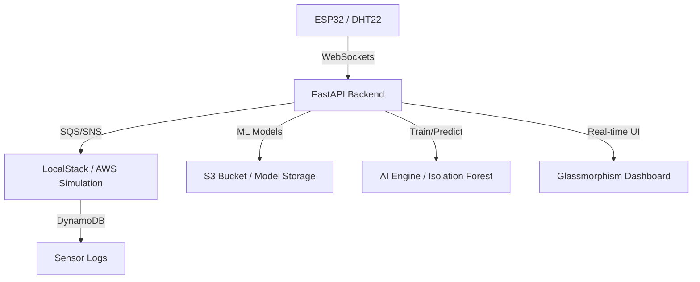

# Zero-Cost Cloud Native: Arsitektur Pipeline IoT & AI Hybrid dengan LocalStack

[English](README.md) | [Bahasa Indonesia](README-id.md)

Proyek monitoring Smart Room tingkat lanjut yang terintegrasi dengan **Unsupervised Anomaly Detection (Isolation Forest)** dan **Klasifikasi Kondisi Real-time (Random Forest)**. Dibangun dengan filosofi "Zero-Cost", menggunakan [LocalStack](https://www.localstack.cloud/) untuk mensimulasikan seluruh ekosistem AWS Cloud di mesin lokal Anda.

## 🏗️ Arsitektur Sistem


### Alur Logika


## ✨ Fitur Utama


### 🛡️ Deteksi Anomali Cerdas
Menggunakan algoritma **Isolation Forest** untuk mengidentifikasi pola lingkungan yang tidak biasa (seperti lonjakan panas tiba-tiba atau kegagalan peralatan) tanpa memerlukan label data pelatihan.
- Penandaan anomali secara real-time pada dashboard.
- Notifikasi Telegram otomatis untuk anomali kritis.

### 🤖 Pipeline AI Hybrid
- **Real-time Inference**: RandomForest mengklasifikasikan kondisi ruangan (Normal vs Perlu Pendinginan) untuk mengontrol aktuator (Kipas, Mist, Heater).
- **Local Inference (NocML)**: ESP32 menjalankan logika ML lokal untuk waktu respon sub-milidetik.
- **Analisis Batch Historis**: Memindai log DynamoDB untuk melakukan analisis AI retrospektif pada data sensor masa lalu.

### 🌓 UI/UX Premium
- **Desain Glassmorphism**: Dashboard modern dengan lapisan transparan dan gradien yang cerah.
- **Dark/Light Mode**: Tema yang dapat diganti dengan persistensi penyimpanan lokal.
- **Lucide Icons**: Ikon vektor profesional menggantikan emoji tradisional.
- **Chart.js**: Visualisasi dinamis real-time dari tren sensor.

### ☁️ Simulasi AWS Tanpa Biaya (LocalStack)
- **DynamoDB**: Penyimpanan NoSQL yang dapat diskalakan untuk riwayat sensor.
- **S3**: Repositori terpusat untuk file model `.pkl`.
- **SNS/SQS**: Arsitektur berbasis event untuk pengiriman peringatan yang andal.
- **CloudWatch**: Pemantauan infrastruktur dan pelacakan metrik.

## 📂 Struktur Folder
```text
iot-ai-localstack/
├── backend/            # FastAPI, Integrasi AWS & Model ML
│   ├── app/            # Logika Bisnis & Pipeline AI
│   ├── data/           # Cache Model Lokal
│   └── .env.example    # Template Konfigurasi
├── frontend/           # Dashboard (HTML/CSS/JS)
├── microcontroller/    # Firmware ESP32 FreeRTOS
│   └── esp32/
├── images/             # Aset Dokumentasi
└── .gitignore
```

## 🚀 Memulai

### 1. Prasyarat
- Docker (untuk LocalStack)
- Python 3.10+
- Arduino IDE (untuk ESP32)

### 2. Menjalankan Infrastruktur
```bash
pip install localstack
localstack start -d
```

### 3. Setup Backend
1. Buat file `backend/.env` berdasarkan `.env.example`.
2. Instal dependensi dan jalankan server:
```bash
cd backend
python -m venv venv
source venv/Scripts/activate # Windows
pip install -r requirements.txt
uvicorn app.main:app --reload --host 0.0.0.0
```

### 4. Deployment ESP32
1. Buka `microcontroller/esp32/esp32.ino`.
2. Atur `ssid`, `password`, dan `server_ip`.
3. Unggah ke board (Pin: DHT25, Kipas 14, Mist 16, Heater 27, Mode 17).

### 5. Akses Dashboard
Buka file `frontend/index.html` di browser Anda.

---
*Dikembangkan untuk **AWS User Group Bandung** untuk mendemonstrasikan desain Cloud-Native yang hemat biaya.*
Dikembangkan dengan ❤️ oleh [Muhammad Ikhwan Fathulloh](https://github.com/Muhammad-Ikhwan-Fathulloh)
