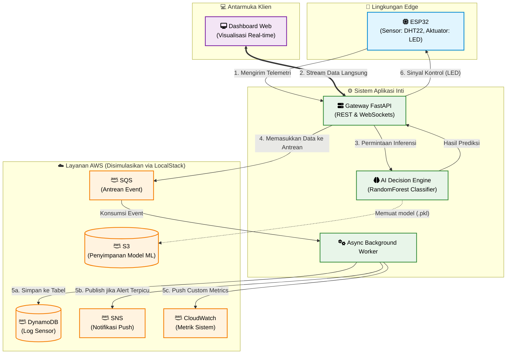

# Zero-Cost Cloud Native: Membangun Arsitektur Hybrid IoT & AI Pipeline dengan LocalStack

[English](README.md) | [Bahasa Indonesia](README-id.md)

Proyek pemantauan IoT (DHT22) yang terintegrasi dengan Machine Learning dan simulasi AWS menggunakan **LocalStack**. Seluruh infrastruktur dirancang untuk berjalan secara lokal tanpa biaya cloud (Zero-Cost).

## 🏗️ Diagram Arsitektur



## ✨ Fitur Utama
- **AWS DynamoDB**: Penyimpanan log sensor real-time dengan skema NoSQL.
- **AWS S3**: Penyimpanan untuk model ML (`.pkl`) yang dilatih otomatis untuk siklus CI/CD.
- **AWS SNS**: Sistem peringatan otomatis melalui Topik saat suhu melebihi batas.
- **AWS SQS**: Arsitektur Event-Driven menggunakan antrean pesan untuk pemrosesan data asinkron.
- **AWS CloudWatch**: Pemantauan metrik sensor (Suhu/Kelembapan) untuk analisis tren infrastruktur.
- **AI Decision Engine**: Klasifikasi kondisi lingkungan menggunakan RandomForest untuk kontrol aktuator (LED).
- **Monitoring Dashboard**: Visualisasi data real-time dengan UI Modern & Chart.js.

## 📂 Struktur Folder
```text
iot-ai-localstack/
├── backend/            # Logika FastAPI & AWS
│   ├── app/            # Kode sumber inti (Logika Bisnis)
│   ├── data/           # Penyimpanan lokal untuk model ML
│   └── requirements.txt
├── microcontroller/    # Kode ESP32 (Arduino/C++)
│   └── esp32/
├── frontend/           # Dashboard Pemantauan (HTML/CSS/JS)
├── .gitignore
└── README.md
```

## 🚀 Panduan Instalasi & Penggunaan

### 1. Persiapan Infrastruktur (LocalStack)
Pastikan Docker berjalan di sistem Anda. Anda juga memerlukan LocalStack CLI yang dapat diinstal via Python:
```bash
pip install localstack
```
Setelah itu, mulai LocalStack:
```bash
localstack start -d
```
*Layanan yang akan diinisialisasi otomatis: S3, SQS, SNS, DynamoDB, CloudWatch.*

### 2. Konfigurasi Backend & Menjalankan Server
Arahkan ke folder `backend`, siapkan environment, dan jalankan server:

**Windows:**
```powershell
cd backend
python -m venv venv
.\venv\Scripts\python.exe -m pip install -r requirements.txt
.\venv\Scripts\uvicorn.exe app.main:app --reload --host 0.0.0.0
```

**Linux/macOS:**
```bash
cd backend
python3 -m venv venv
source venv/bin/activate
pip install -r requirements.txt
uvicorn app.main:app --reload --host 0.0.0.0
```

### 3. Mengakses Dashboard (Frontend)
Buka file `frontend/index.html` di browser Anda.
> **Tips:** Gunakan ekstensi "Live Server" di VS Code untuk pengalaman pengembangan yang lebih baik.

### 4. Setup Mikrokontroler (ESP32)
1. Buka file `microcontroller/esp32/esp32.ino` di **Arduino IDE**.
2. Instal library berikut melalui Library Manager atau unduh secara manual:
   - [DHT sensor library oleh Adafruit](https://github.com/adafruit/DHT-sensor-library)
   - [WebSockets oleh Links2004](https://github.com/Links2004/arduinoWebSockets)
   - [ArduinoJson oleh bblanchon](https://github.com/bblanchon/ArduinoJson)
   - [LiquidCrystal_I2C oleh johnrickman](https://github.com/johnrickman/LiquidCrystal_I2C)
3. Sesuaikan variabel berikut:
   - `ssid`: Nama WiFi Anda.
   - `password`: Kata sandi WiFi Anda.
   - `server_ip`: IP Laptop/PC Anda (jalankan `ipconfig` atau `ifconfig` di terminal untuk memeriksa).
4. Upload kode ke papan ESP32 Anda.

## 🛠️ Detail Layanan AWS

1. **DynamoDB** (Database NoSQL)
   - **Nama Tabel**: `IoT_Sensor_Data` (Partition Key: `id`)
   - **Peran**: Berfungsi sebagai penyimpanan utama untuk semua log data sensor (suhu dan kelembapan) yang dikirim oleh ESP32. Skema NoSQL memungkinkan penyimpanan data time-series secara fleksibel dan efisien.

2. **S3** (Simple Storage Service)
   - **Nama Bucket**: `iot-ai-models`
   - **Peran**: Digunakan sebagai penyimpanan objek (object storage) untuk menyimpan file model Machine Learning (`.pkl`). Model ini di-load oleh backend FastAPI saat startup untuk melakukan inferensi kondisi lingkungan berdasarkan data sensor.

3. **SNS** (Simple Notification Service)
   - **Nama Topik**: `IoT_Alerts`
   - **Peran**: Layanan pub/sub yang menangani sistem notifikasi. Jika AI mendeteksi kondisi tidak normal atau suhu melebihi batas, sistem akan mempublikasikan peringatan ke topik ini, yang dapat diteruskan sebagai email atau SMS.

4. **SQS** (Simple Queue Service)
   - **Nama Antrean**: `IoT_Sensor_Queue`
   - **Peran**: Bertindak sebagai antrean pesan (message queue) untuk memisahkan (decouple) proses penerimaan data dari proses penyimpanan dan notifikasi. Data masuk ke SQS terlebih dahulu, kemudian diproses oleh *Background Worker* secara asinkron agar API tetap responsif.

5. **CloudWatch** (Monitoring & Metrics)
   - **Namespace**: `IoT/DHT22`
   - **Peran**: Mengumpulkan dan memantau metrik khusus (custom metrics) dari sensor. Ini berguna untuk memantau performa, menganalisis tren data, dan memonitor kesehatan sistem infrastruktur IoT.

---
Dikembangkan dengan ❤️ oleh [Muhammad Ikhwan Fathulloh](https://github.com/Muhammad-Ikhwan-Fathulloh)
