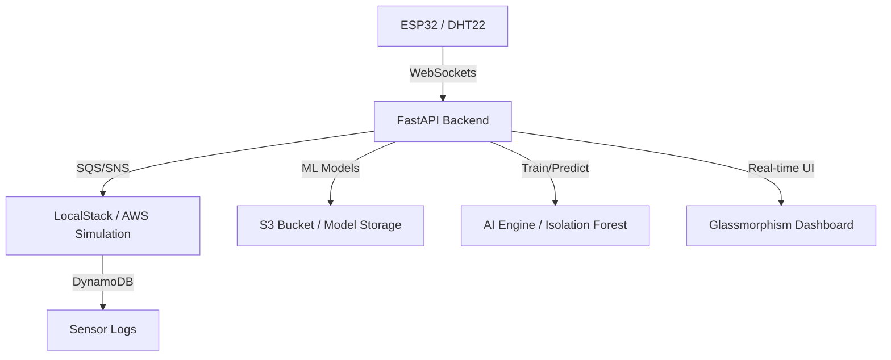

# Zero-Cost Cloud Native: Architecting Hybrid IoT & AI Pipelines with LocalStack

[English](README.md) | [Bahasa Indonesia](README-id.md)

An advanced IoT Smart Room Monitoring project integrated with **Unsupervised Anomaly Detection (Isolation Forest)** and **Real-time Environmental Classification (Random Forest)**. Built with a "Zero-Cost" philosophy, using [LocalStack](https://www.localstack.cloud/) to simulate the entire AWS Cloud ecosystem on your local machine.

## 🏗️ System Architecture


### Logic Flow


## ✨ Key Features


### 🛡️ Intelligent Anomaly Detection
Uses the **Isolation Forest** algorithm to identify unusual environmental patterns (e.g., sudden heat spikes or equipment failure) without requiring labeled training data.
- Real-time anomaly flagging on the dashboard.
- Automated Telegram notifications for critical anomalies.

### 🤖 Hybrid AI Pipeline
- **Real-time Inference**: RandomForest classifies room conditions (Normal vs. Cooling Needed) to control actuators (Kipas, Mist, Heater).
- **Local Inference (NocML)**: The ESP32 runs local ML logic for sub-millisecond response times.
- **Historical Batch Analysis**: Scan DynamoDB logs to perform retrospective AI analysis on past sensor data.

### 🌓 Premium UI/UX
- **Glassmorphism Design**: A sleek, modern dashboard using transparent layers and vibrant gradients.
- **Dark/Light Mode**: Toggleable themes with local storage persistence.
- **Lucide Icons**: Professional vector icons replacing traditional emojis.
- **Chart.js**: Dynamic real-time visualization of sensor trends.

### ☁️ Zero-Cost AWS Simulation (LocalStack)
- **DynamoDB**: Scalable NoSQL storage for sensor history.
- **S3**: Centralized repository for `.pkl` model files.
- **SNS/SQS**: Event-driven architecture for reliable alert delivery.
- **CloudWatch**: Infrastructure monitoring and metric tracking.

## 📂 Folder Structure
```text
iot-ai-localstack/
├── backend/            # FastAPI, AWS Integrations & ML Models
│   ├── app/            # Business Logic & AI Pipeline
│   ├── data/           # Local Model Cache
│   └── .env.example    # Configuration Template
├── frontend/           # Dashboard (HTML/CSS/JS)
├── microcontroller/    # ESP32 FreeRTOS Firmware
│   └── esp32/
├── images/             # Documentation Assets
└── .gitignore
```

## 🚀 Getting Started

### 1. Prerequisites
- Docker (for LocalStack)
- Python 3.10+
- Arduino IDE (for ESP32)

### 2. Startup Infrastructure
```bash
pip install localstack
localstack start -d
```

### 3. Backend Setup
1. Create `backend/.env` based on `.env.example`.
2. Install dependencies and start the server:
```bash
cd backend
python -m venv venv
source venv/Scripts/activate # Windows
pip install -r requirements.txt
uvicorn app.main:app --reload --host 0.0.0.0
```

### 4. ESP32 Deployment
1. Open `microcontroller/esp32/esp32.ino`.
2. Set your `ssid`, `password`, and `server_ip`.
3. Upload to board (Pins: DHT25, Kipas 14, Mist 16, Heater 27, Mode 17).

### 5. Access Dashboard
Simply open `frontend/index.html` in your browser.

## 🛠️ Configuration Values
| Variable              | Description         | Default (LocalStack)    |
| --------------------- | ------------------- | ----------------------- |
| `AWS_REGION`          | Simulated region    | `us-east-1`             |
| `LOCALSTACK_ENDPOINT` | LocalStack address  | `http://localhost:4566` |
| `TELEGRAM_BOT_TOKEN`  | Required for alerts | From @BotFather         |

---
*Developed for **AWS User Group Bandung** to demonstrate cost-effective Cloud-Native design.*
Developed by [Muhammad Ikhwan Fathulloh](https://github.com/Muhammad-Ikhwan-Fathulloh)