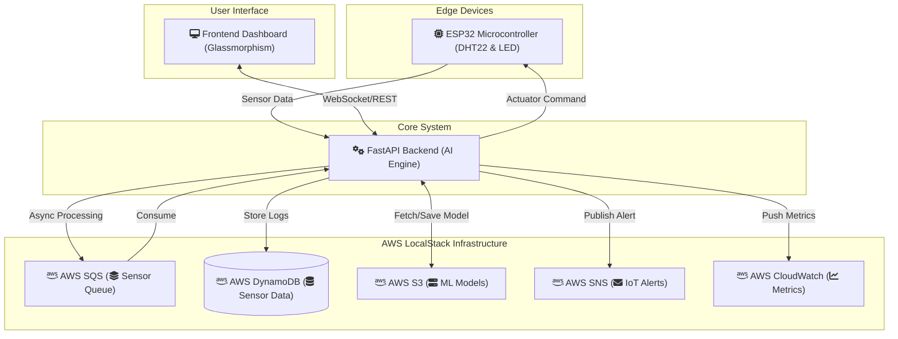

# Zero-Cost Cloud Native: Architecting Hybrid IoT & AI Pipelines with LocalStack

An IoT monitoring project (DHT22) integrated with Machine Learning and AWS simulation using **LocalStack**. The entire infrastructure is designed to run locally without any cloud costs (Zero-Cost).

## 🏗️ Architecture Diagram



## ✨ Key Features
- **AWS DynamoDB**: Real-time sensor log storage with NoSQL schema.
- **AWS S3**: Storage for ML models (`.pkl`) trained automatically for CI/CD cycles.
- **AWS SNS**: Automated alert system via Topics when temperature exceeds thresholds.
- **AWS SQS**: Event-Driven architecture using message queues for asynchronous data processing.
- **AWS CloudWatch**: Monitoring sensor metrics (Temperature/Humidity) for infrastructure trend analysis.
- **AI Decision Engine**: Environmental condition classification using RandomForest for actuator control (LED).
- **Premium Dashboard**: Real-time data visualization with Glassmorphism UI & Chart.js.

## 📂 Folder Structure
```text
iot-ai-localstack/
├── backend/            # FastAPI & AWS Logic
│   ├── app/            # Core source code (Business Logic)
│   ├── data/           # Local storage for ML models
│   └── requirements.txt
├── microcontroller/    # ESP32 Code (Arduino/C++)
│   └── esp32/
├── frontend/           # Monitoring Dashboard (HTML/CSS/JS)
├── .gitignore
└── README.md
```

## 🚀 Installation & Usage Guide

### 1. Infrastructure Preparation (LocalStack)
Ensure Docker is running on your system, then start LocalStack using Docker or the LocalStack CLI:
```bash
localstack start -d
```
*Services that will be auto-initialized: S3, SQS, SNS, DynamoDB, CloudWatch.*

### 2. Backend Configuration & Startup
Navigate to the `backend` folder, set up the environment, and run the server:

**Windows:**
```powershell
cd backend
python -m venv venv
.\venv\Scripts\python.exe -m pip install -r requirements.txt
.\venv\Scripts\uvicorn.exe app.main:app --reload --host 0.0.0.0
```

**Linux/macOS:**
```bash
cd backend
python3 -m venv venv
source venv/bin/activate
pip install -r requirements.txt
uvicorn app.main:app --reload --host 0.0.0.0
```

### 3. Access Dashboard (Frontend)
Open the `frontend/index.html` file in your browser.
> **Tip:** Use the "Live Server" extension in VS Code for a better development experience.

### 4. Microcontroller Setup (ESP32)
1. Open the `microcontroller/esp32/esp32.ino` file in **Arduino IDE**.
2. Install the required libraries: `DHT sensor library`, `WebSockets`, `ArduinoJson`.
3. Adjust the following variables:
   - `ssid`: Your WiFi name.
   - `password`: Your WiFi password.
   - `server_ip`: Your Laptop/PC IP (run `ipconfig` or `ifconfig` in terminal to check).
4. Upload the code to your ESP32 board.

## 🛠️ AWS Services Detail
- **DynamoDB**: Table `IoT_Sensor_Data` (Partition Key: `id`).
- **S3**: Bucket `iot-ai-models` (Storage for `.pkl` models).
- **SNS**: Topic `IoT_Alerts` (Trigger for temperature alerts).
- **SQS**: Queue `IoT_Sensor_Queue` (Async data processing).
- **CloudWatch**: Namespace `IoT/DHT22` (Custom sensor metrics).

---
Developed with ❤️ by [Muhammad Ikhwan Fathulloh](https://github.com/Muhammad-Ikhwan-Fathulloh)